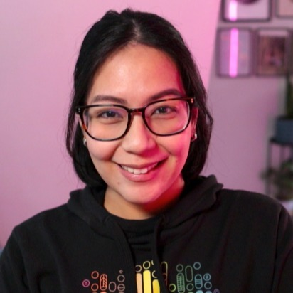

## Hi there! 👋

Hi! My name is Marie, and I've been testing software for more than 10 years now. Currently, I work as a Senior Developer Advocate at Grafana Labs. Previously, I worked as an engineering manager responsible for driving continuous testing and quality improvements, and as a principal engineer, I focused on introducing recommended practices for testing and test automation frameworks.

Find me on: [LinkedIn](https://www.linkedin.com/in/mariedesireecruz/), [YouTube](https://www.youtube.com/@TestingwithMarie), [GitHub](https://github.com/mdcruz).

📚 I'm also the co-author of the book, [Contract Testing in Action](https://shortener.manning.com/qOn2), which is now available in Manning as part of their Early Access Program.

