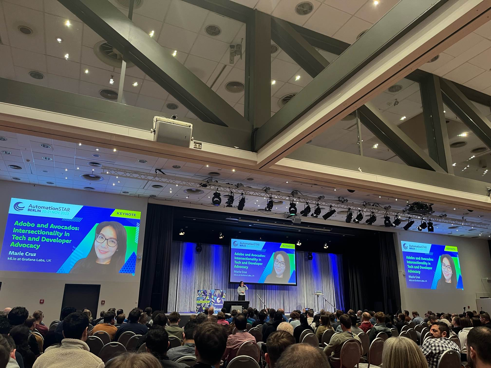
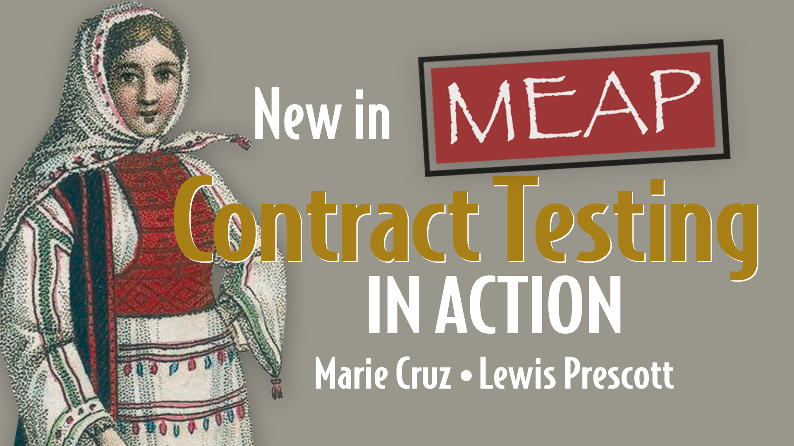

### Short bio (for speaker profile)

Marie Cruz is a Software Tester with over 10 years of experience and currently works as a Senior Developer Advocate for Grafana Labs. She is also the co-author of [Contract Testing in Action](https://shortener.manning.com/qOn2), the first book dedicated solely to contract testing, and an international speaker. She has previously worked as an engineering manager responsible for driving continuous testing and quality improvements, and as a principal engineer, she focused on introducing recommended practices for testing and test automation frameworks.

### Long bio

Marie Cruz is a Software Tester with over 10 years of experience who enjoys learning and sharing it publicly. She is a Filipina living in England and a mum to two kids (and two dogs 🐾). Because of her passion for teaching, in 2022, she decided to enter the world of Developer Relations. Today, she works as a Senior Developer Advocate for [Grafana Labs](https://grafana.com/), the company behind Grafana, Loki, Mimir, and Tempo, the leading open-source software for visualizing operational data. 

She is the co-author of [Contract Testing in Action](https://shortener.manning.com/qOn2), the first book dedicated solely to contract testing, and an international speaker. She has spoken at different conferences on topics ranging from test automation to performance testing, accessibility testing, intersectionality, and more. 

She is also a host at [Adobo and Avocados](https://www.youtube.com/@adoboandavocados), a podcast/live stream on which she collaborates with Nicole van der Hoeven. They discuss what it's like to work in tech for members of minority groups, intersectionality in software, and how to advocate for diversity.

She has previously worked as an engineering manager responsible for driving continuous testing and quality improvements, and as a principal engineer, she focused on introducing recommended practices for testing and test automation frameworks.

