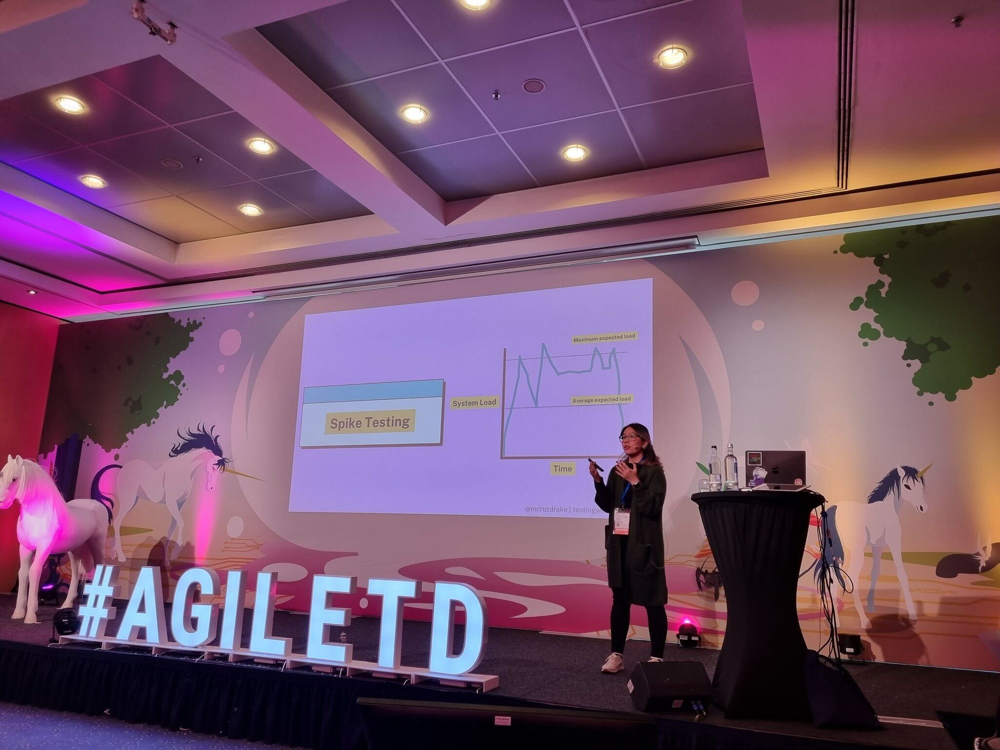

Below is a list of speaking engagements from various conferences, meetups, and podcasts I have spoken at to become comfortable with public speaking.

## 2026
- 2026-02-05 [Grafana & Friends London](https://www.meetup.com/grafana-and-friends-london): (London, UK) [APIs Made Useful: Transforming Your API Data into Impactful Grafana Dashboards](https://www.meetup.com/grafana-and-friends-london/events/312279058/)
- 2026-02-06 [Grafana & Friends Mumbai](https://www.meetup.com/grafana-and-friends-mumbai): (Virtual) [Observability Made Simple: Monitoring Plants with IoT and Grafana](https://www.meetup.com/grafana-and-friends-mumbai/events/312815181/)
- 2025-02-20 [Grafana Labs](https://grafana.com/): (Online) [Getting started with Grafana dashboard design](https://grafana.com/go/webinar/getting-started-with-grafana-dashboard-design/?pg=videos&plcmt=upcoming-webinars)

## 2025

- 2025-12-18 [Conf42 IoT](https://www.conf42.com/iot2025): (Online) [STEM in the Garden: How to Monitor Plants with IoT Sensors and Grafana Cloud](https://www.conf42.com/Internet_of_Things_IoT_2025_Marie_Cruz_sensors_gardening_analytics)
- 2025-12-03 [Grafana Labs](https://grafana.com/): (Online) [Intro to Application and Frontend Observability with Grafana Cloud](https://grafana.com/go/webinar/intro-to-application-and-frontend-observability-with-grafana-cloud/?pg=videos&plcmt=ondemand)
- 2025-11-13 [Grafana Labs x Coding Black Females](https://www.eventbrite.co.uk/e/apis-to-omg-transform-your-api-data-to-fun-grafana-dashboards-tickets-1738049124719): (London, UK) [APIs to OMG: Transform your API data to fun Grafana dashboards](https://www.eventbrite.co.uk/e/apis-to-omg-transform-your-api-data-to-fun-grafana-dashboards-tickets-1738049124719)
- 2025-10-24 [CBFFEST](https://cbf.zohobackstage.eu/fest#/): (Online) [STEM in the Garden: How to Monitor Plants with IoT Sensors and Grafana Cloud](https://cbf.zohobackstage.eu/fest#/agenda?day=1&lang=en&sessionId=28071000000483162)
- 2025-10-02 [TestBash UK](https://www.ministryoftesting.com/events/testbash-brighton-2025): (Brighton, UK) [Contract testing: the route to confident deployments](https://www.ministryoftesting.com/events/testbash-brighton-2025)
- 2025-09-24 [apidays London](https://www.apidays.global/archive/2025/london): (London, UK) [Infinity and Beyond: Visualise your APIs](https://www.apidays.global/archive/2025/london)
- 2025-09-19 [SREday London Q3](https://sreday.com/2025-london-q3/): (London, UK) [Observability Made Simple: Monitoring Plants with IoT and Grafana](https://sreday.com/2025-london-q3/)
- 2025-06-24 [Grafana & Friends London](https://www.meetup.com/grafana-and-friends-london): (London, UK) [STEM in the Garden: How to Monitor Plants with IoT Sensors and Grafana Cloud](https://www.meetup.com/grafana-and-friends-london/events/308083109)
- 2025-02-11 [Automation Guild](https://testguild.com/automation-guild-2025/): (Online) [Breaking Silos: Contract Testing for Today’s API-Driven World](https://testguild.com/automation-guild-2025/)

## 2024

- 2024-06 to 2024-12 (parental leave)
- 2024-06-07 [The Test Automation Experience](https://www.youtube.com/@test-automation-experience): (Online) [Contract Testing 101](https://www.youtube.com/watch?v=cw3z98ioIGY)
- 2024-06-02 [TestGuild](https://testguild.com/): (Online) [Discover the Power of Contract Testing Now!](https://www.youtube.com/watch?v=Zovjpnckxrg)
- 2024-01-18 [XP Series Webinar](https://www.lambdatest.com/): (Online) [Fast and Furious: The Psychology of Web Performance](https://www.youtube.com/watch?v=AlpsEAmd9fY)

## 2023

- 2023-12-15 [The Test Automation Experience](https://www.youtube.com/@test-automation-experience): (Online) [Mastering Front-End Performance Testing](https://www.youtube.com/watch?v=zzB9jXc0_cU)
- 2023-12-08 [The Test Automation Experience](https://www.youtube.com/@test-automation-experience): (Online) [Mastering Performance Testing](https://www.youtube.com/watch?v=WGr_zt54tmA)
- 2023-12-07 [TestJS Summit](https://automation.eurostarsoftwaretesting.com/): (Online) [Holistic Web Performance With Grafana and K6](https://gitnation.com/contents/https6511ca6291ce1702b78e3ea8-wgdsnetlifyapp)
- 2023-11-21 [AutomationSTAR](https://automation.eurostarsoftwaretesting.com/): (Berlin, Germany) [Adobo and Avocados: Intersectionality in Tech and Developer Advocacy](https://automation.eurostarsoftwaretesting.com/event/2023/adobo-and-avocados-intersectionality-in-tech-and-developer-advocacy/)
- 2023-11-16 [Agile Testing Days](https://agiletestingdays.com/): (Potsdam, Germany) [Adobo and Avocados: Intersectionality in Tech and Developer Advocacy](https://agiletestingdays.com/2023/session/adobo-and-avocados-intersectionality-in-tech-and-devrel/)
- 2023-11-15 [Agile Testing Days](https://agiletestingdays.com/): (Potsdam, Germany) [The Psychology of Waiting](https://agiletestingdays.com/2023/session/the-psychology-of-waiting/)
- 2023-09-28 [Transcend Tech Leeds](www.meetup.com/transcend-tech-leeds/): (Leeds, UK) [A Hybrid Approach to Performance Testing](https://www.meetup.com/transcend-tech-leeds/events/295886706/)
- 2023-09-21 [TestBash UK](https://www.ministryoftesting.com/): (Liverpool, UK) [Hands-on with Grafana k6](https://www.ministryoftesting.com/events/testbash-uk-2023)
- 2023-09-21 [TestBash UK](https://www.ministryoftesting.com/): (Liverpool, UK) [Let's play the waiting game!](https://www.ministryoftesting.com/events/testbash-uk-2023)
- 2023-09-20 [TestBash UK](https://www.ministryoftesting.com/): (Liverpool, UK) [The Psychology of Web Performance](https://www.ministryoftesting.com/events/testbash-uk-2023)
- 2023-08-31 [Ministry of Testing Masterclass](https://www.ministryoftesting.com/): (Online) [The Psychology of Web Performance](https://www.ministryoftesting.com/events/the-psychology-of-web-performance)
- 2023-08-22 [Testμ 2023](https://www.lambdatest.com/): (Online) [A Hybrid Approach to Performance Testing](https://www.youtube.com/watch?v=1TcR0GNwvqQ)
- 2023-06-29 [Agile Test Automation Vienna](https://www.meetup.com/agile-test-automation-meetup-vienna): (Online) [A Hybrid Approach to Performance Testing with k6](https://www.meetup.com/agile-test-automation-meetup-vienna/events/293818373)
- 2023-06-14 [Agile Testing Days Open Air](https://agiletestingdays.com/): (Cologne, Germany) [A Medley of Frontend and Backend Performance Testing](https://openair.agiletestingdays.com/2023/session/a-medley-of-frontend-and-backend-performance-testing/)
- 2023-05-31 [Ministry of Testing Athens](https://motathens.gr/): (Athens, Greece) [A Hybrid Approach to Performance Testing](https://motathens.gr/)
- 2023-05-23 [Live2Test](https://live2test.com/): (Online) [Performance Testing 101](https://live2test.com/live2test-2023/)
- 2023-05-16 [Global Testers Summit](https://www.qatouch.com/global-testers-summit-2023/): (Online) [A Hybrid Approach to Performance Testing](https://www.qatouch.com/global-testers-summit-2023/)
- 2023-04-18 [Axelerant QA Q&A](https://www.linkedin.com/company/axelerant/): (Online) [Myths, Processes, and Practices of Accessibility Testing](https://www.youtube.com/watch?v=_eyKJ_r9uMY)
- 2023-02-23 [CMG Impact](https://cmgimpact.com/): (Online) [Fast and Furious: The Psychology of Web Performance](https://cmgimpact.com/fast-and-furious-the-psychology-of-web-performance/)
- 2023-02-09 [Automation Guild](https://testguild.com/): (Online) [Browser Automation And Frontend Performance with xk6-Browser](https://www.youtube.com/watch?v=IQIaEanJ2HE&t=745s)

## 2022

- 2022-12-01 [ReTestBash UK](https://www.ministryoftesting.com/): (Online) [Performance Testing 101](https://www.ministryoftesting.com/events/retestbash-uk-2022)
- 2022-11-24 [Agile Testing Days](https://agiletestingdays.com/): (Potsdam, Germany) [Learning the Fundamentals of Performance Testing](https://agiletestingdays.com/2022/session/learning-the-fundamentals-of-performance-testing/)
- 2022-11-10 [Test Academy](https://event.testacademy.es/malaga/): (Malaga, Spain) [Performance Testing 101](https://event.testacademy.es/malaga/index.php/events/testing-rendimiento-101/)
- 2022-11-09 [Ministry of Testing 99 mins workshop](https://www.ministryoftesting.com/): (Online) [Performance Testing 101](https://www.ministryoftesting.com/events/performance-testing-101)
- 2022-11-03 [TestJS Summit](https://testjssummit.com/): (Online) [A Medley of Frontend and Backend Performance Testing](https://gitnation.com/contents/a-medley-of-frontend-and-backend-performance-testing)
- 2022-10-20 [Test.bash();](https://www.ministryoftesting.com/): (Online) [UI Automation Challenge](https://www.ministryoftesting.com/events/test-bash-2022)
- 2022-10-18 [CMG Impact](https://cmgimpact.com/): (Online) [A Hybrid Approach to Performance Testing](https://www.cmg.org/2022/09/a-hybrid-approach-to-performance-testing/)
- 2022-09-21 [TestBash UK](https://www.ministryoftesting.com/): (Manchester, UK) [Performance Testing 101](https://www.ministryoftesting.com/events/testbash-uk-2022)
- 2022-09-09 [Testival](https://testival.eu/): (Osijek, Croatia) [Shifting Accessibility Testing to the Left](https://testival.eu/testival-osijek-2022-sponsors-and-speakers/)
- 2022-06-23 [Front-End Test Fest](https://applitools.com/resources/front-end-test-fest/): (Online) [Shifting Accessibility Testing to the Left](https://applitools.com/resources/events/fetf2022-shifting-accessibility-testing-to-the-left/)
- 2022-06-16 [Test Automation Talks](https://www.meetup.com/test-automation-talks/): (Online) [Shifting Accessibility Testing to the Left](https://www.meetup.com/test-automation-talks/events/285941739/)
- 2022-05-25 [PractiTest](https://www.practitest.com/): (Online) [Shifting Accessibility Testing to the Left](https://www.practitest.com/resource-center/webinar/shifting-accessibility-testing-left/)
- 2022-05-19 [Agile Testing Days Open Air](https://agiletestingdays.com/): (Cologne, Germany) [Shifting Accessibility Testing to the Left](https://openair.agiletestingdays.com/2022/session/shifting-accessibility-testing-to-the-left/)
- 2022-05-18 [Agile Testing Days Open Air](https://agiletestingdays.com/): (Cologne, Germany) [Introduction to Cypress.io](https://openair.agiletestingdays.com/2022/session/introduction-to-cypressio/)
- 2022-03-10 [TestBash Leadership](https://www.ministryoftesting.com/): (Online) [Lessons Learned As A Quality Engineering Manager](https://www.ministryoftesting.com/events/testbash-leadership-2022)
- 2022-03-04 [Worqference](https://www.thetesttribe.com/worqference/): (Online) [Contract Testing with Pact JS](https://www.thetesttribe.com/worqference/)
- 2022-03-03 [Cypress.io User Group Philippines](https://www.meetup.com/cypressioph/): (Online) [A Collection of My Favourite Cypress Features](https://www.meetup.com/cypressioph/events/283706818/)
- 2022-01-08 [The Test Tribe](https://www.thetesttribe.com/): (Online) [Leveraging Cypress Beyond Functional Tests](https://www.youtube.com/watch?v=fDI2ijHu30c)

## 2021

- 2021-12-22 [QAFox](https://www.youtube.com/@QAFox): (Online) [Introduction to k6](https://www.youtube.com/watch?v=8aPpeMkKs54&t=1s)
- 2021-11-18 [Perfecto](https://www.perfecto.io/): (Online) [Special Edition: Industry Panel Emerging Frameworks – Hot or Not?](https://www.perfecto.io/webinars/special-edition-industry-panel-emerging-frameworks-hot-or-not)
- 2021-11-02 [EuroSTAR](https://huddle.eurostarsoftwaretesting.com/): (Online) [Leveraging Cypress beyond Functional Testing](https://huddle.eurostarsoftwaretesting.com/resources/test-automation/leveraging-cypress-beyond-functional-testing/)
- 2021-10-28 [Test.bash();](https://www.ministryoftesting.com/): (Online) [Tooling for automated testing](https://www.ministryoftesting.com/events/test-bash-2021)
- 2021-10-23 [TestFlix](https://www.thetesttribe.com/testflix/): (Online) [Contract testing 101](https://www.youtube.com/watch?v=BVE-ma1ZDzI&list=PLlRvqUzNMyN7udZA7eFtl12BCKFyP9I5m&index=16)
- 2021-09-30 [Future of Testing: Frameworks](https://applitools.com/future-of-testing-frameworks-north-america-2021/): (Online) [Expert Panel: Thoughts on Test Automation Frameworks](https://applitools.com/future-of-testing-frameworks-north-america-2021/#event-agenda)
- 2021-09-16 [Test Automation Talks](https://www.meetup.com/test-automation-talks/): (Online) [Leveraging Cypress beyond Functional Testing](https://www.youtube.com/watch?v=AhbTIu-RbBc)
- 2021-07-28 [CTM: Continuous Testing Meetup](https://www.meetup.com/continuous-testing-meetup-berlin/): (Online) [Shifting Accessibility Testing to the Left](https://www.meetup.com/continuous-testing-meetup-berlin/events/278475889)
- 2021-07-14 [South West Test](https://www.meetup.com/South-West-Test/): (Online) [Shifting Accessibility Testing to the Left](https://www.meetup.com/South-West-Test/events/278846933/)
- 2021-03-23 [Ministry of Testing Philippines](https://www.meetup.com/mot-ph/): (Online) [Performance Testing with Cypress, Lighthouse and k6](https://www.facebook.com/ministryoftestingphilippines/videos/1011272159418642/)
- 2021-03-11 [QA in London](https://www.meetup.com/QA-in-London/): (Online) [Shifting Accessibility Testing to the Left](https://www.youtube.com/watch?v=0URKi9NmL-I)
- 2021-02-12 [Automation Guild](https://testguild.com/): (Online) [Performance Testing using Cypress.io](https://testguild.com/conferences/ag-2021/)
- 2021-02-09 [Ministry of Testing](https://www.ministryoftesting.com/): (Online) [Panel Discussion: Automating UIs](https://www.ministryoftesting.com/events/panel-discussion-automating-uis)
- 2021-02-04 [Quality Advocates](https://www.meetup.com/quality-advocates/): (Online) [Testing Times, Testing Topics: Flipping the script on manual testing](https://www.youtube.com/watch?v=11fukbS_jRY)
- 2021-01-20 [Burns Sheehan](https://www.burnssheehan.co.uk/): (Online) [Influencing Quality & tackling the problems that come with it](https://www.youtube.com/watch?v=zKyp4uWxah0)

## 2020

- 2020-11-18 [JSTalks](https://www.jstalks.net/): (Online) [Modern Web Testing with Cypress](https://www.youtube.com/watch?v=765jFfTtG1U)
- 2020-09-08 [Ministry of Testing](https://www.ministryoftesting.com/): (Online) [Testing Ask Me Anything - Automation](https://www.ministryoftesting.com/events/testing-ask-me-anything-automation-marie-drake)
- 2020-09-03 [TAQFull](https://www.meetup.com/taqfull/): (Online) [Test Automation Practices from Innovative Brands](https://www.youtube.com/watch?v=Vo-PhgrOT0A)
- 2020-08-09 [TestGuild](https://testguild.com/): (Online) [Cypress and QA Strategy](https://testguild.com/podcast/automation/a316-marie/)
- 2020-07-23 [Quality Advocates](https://www.meetup.com/quality-advocates/): (Online) [What is Quality and who cares about it?](https://www.youtube.com/watch?v=rh0bP5fVG6M)
- 2020-07-10 [Applitools](https://applitools.com/): (Online) [Roadmap to Testing a Design System](https://applitools.com/blog/roadmap-testing-design-system/)
- 2020-06-30 [TAQFull](https://www.meetup.com/taqfull/): (Online) [Integrate Cypress Tests into CI Pipeline](https://www.youtube.com/watch?v=ssCP6-JHH4E)
- 2020-06-16 [TAQFull](https://www.meetup.com/taqfull/): (Online) [Accessibility Testing with Cypress](https://www.youtube.com/watch?v=oSzW6bQTDDk&feature=youtu.be)
- 2020-05-26 [TAQFull](https://www.meetup.com/taqfull/): (Online) [Mocking XHR requests with Cypress](https://www.youtube.com/watch?v=n_bgmZttNC0&t=2020s)
- 2021-05-21 [South West Test](https://www.meetup.com/South-West-Test/): (Online) [An Introduction to Cypress](https://www.crowdcast.io/e/an-introduction-to-6/register)
- 2020-05-12 [TAQFull](https://www.meetup.com/taqfull/): (Online) [Cypress and iframes](https://www.youtube.com/watch?v=khO8_YAej-s&t=3s)
- 2020-04-28 [TAQFull](https://www.meetup.com/taqfull/): (Online) [Visual Testing with Cypress and Applitools](https://www.youtube.com/watch?v=g-soYkZv_uk&t=1830s)
- 2020-04-28 [NGConf](https://ng-conf.org/): (Online) [Comparing Testing Tools Cypress -vs- Selenium Webinar](https://www.youtube.com/watch?v=UHgtUSAROtc)
- 2020-04-16 [QA in London](https://www.meetup.com/QA-in-London/): (Online) [Getting Started with Cypress](https://www.youtube.com/watch?v=RsYX8MR84O0)
- 2020-04-14 [TAQFull](https://www.meetup.com/taqfull/): (Online) [API Testing with Cypress](https://www.youtube.com/watch?v=3yeHn5xnfP0)

## 2019

- 2019-06-26 [Women of Silicon Roundabout](https://women-in-technology.com/): (London, UK) [Software Testing Trends in 2019](https://www.youtube.com/watch?v=KM51NaA0T_g&t=902s)

## 2018

- 2018-11-08 [DevOps Playground](https://www.meetup.com/devopsplayground/): (London, UK) [Digital Women In Tech - DevOps Playground: Hands on with Cypress](https://www.youtube.com/watch?v=cU7PwGWdqAM&t=739s)
